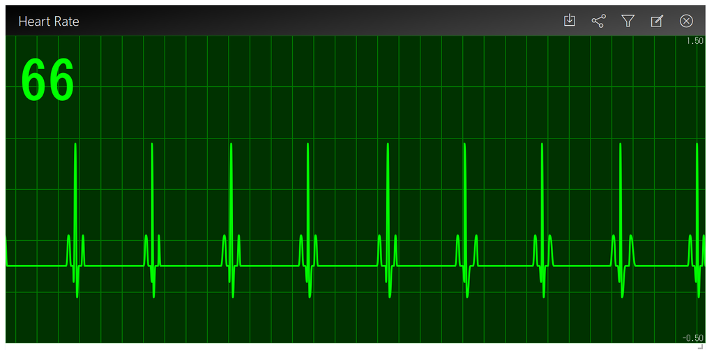

### Electrocardiogram ###
This is an electrocardiogram infotype. 



Please run npm install for the correct dependencies.

```
$ git close git@github.com:horihiro/enebular-infotype-electrocardiogram.git
$ cd enebular-infotype-electrocardiogram
$ npm i # to install enebular-infomotion-tool
# (edit `plugin.js`)
$ npm run build 
```

